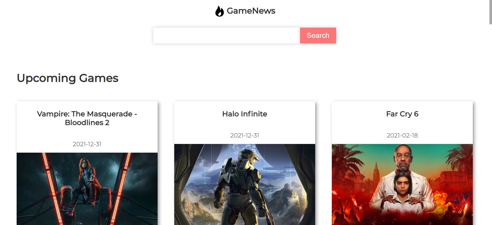
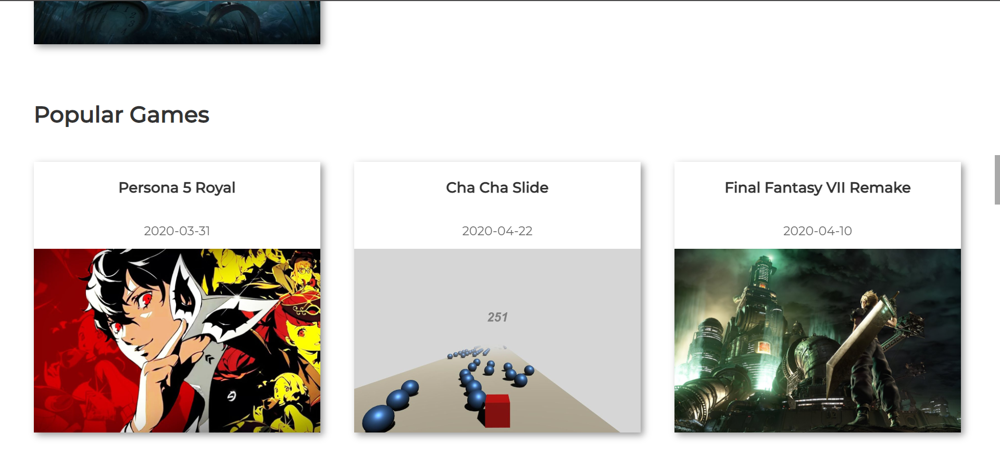
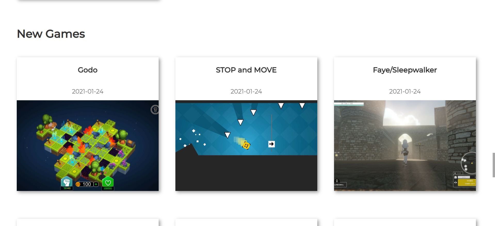
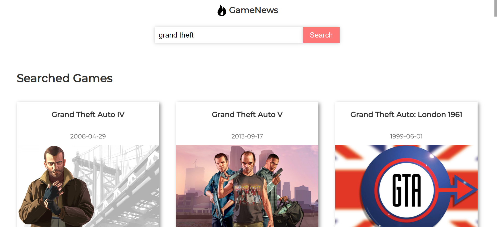
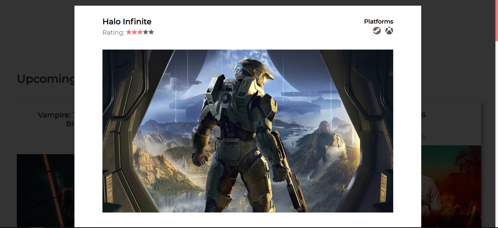
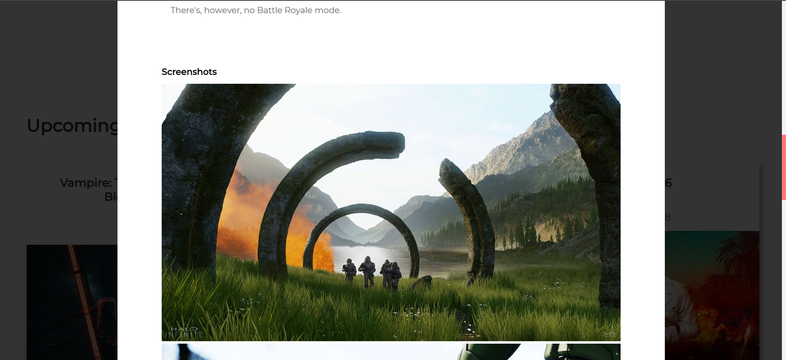

# React Game News

Get the latest gaming related news.

## Description

Fetch the latest, most popular, and new games from <a href='https://rawg.io/'>RAWG</a>
and displays its content. 

  

Data is stored using Redux. 

  

Each game card is animated and mobile friendly. 

  

Search functionality. 

  

Clicking on a card will display the games details,
such as rating, platform compatibility, screenshots, etc. 

  
